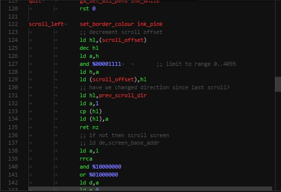

# z80-maxam-vscode

Syntax definition &amp; theme for Z80 assembly code in [Visual Studio Code](https://code.visualstudio.com/)

## Features

Adds syntax highlighting for Z80 code

I use it to write [Maxam](http://www.cpcwiki.eu/index.php/Maxam_1.5)/[WinAPE](http://www.winape.net/) code for the [Amstrad CPC](https://en.wikipedia.org/wiki/Amstrad_CPC) so it may need slight tweaking to work properly with other assemblers

## Installation

Extract contents of this repo into `<user home>/.vscode/extensions/maxam` and restart VS Code. This will automatically associate `.z80` and `.asm` files with this extension

## Color theme

To use the included color theme, go to `File | Preferences | Color Theme` in menu and select `Maxam Z80`

## Release Notes

### 1.0.0

Initial release (not published)
